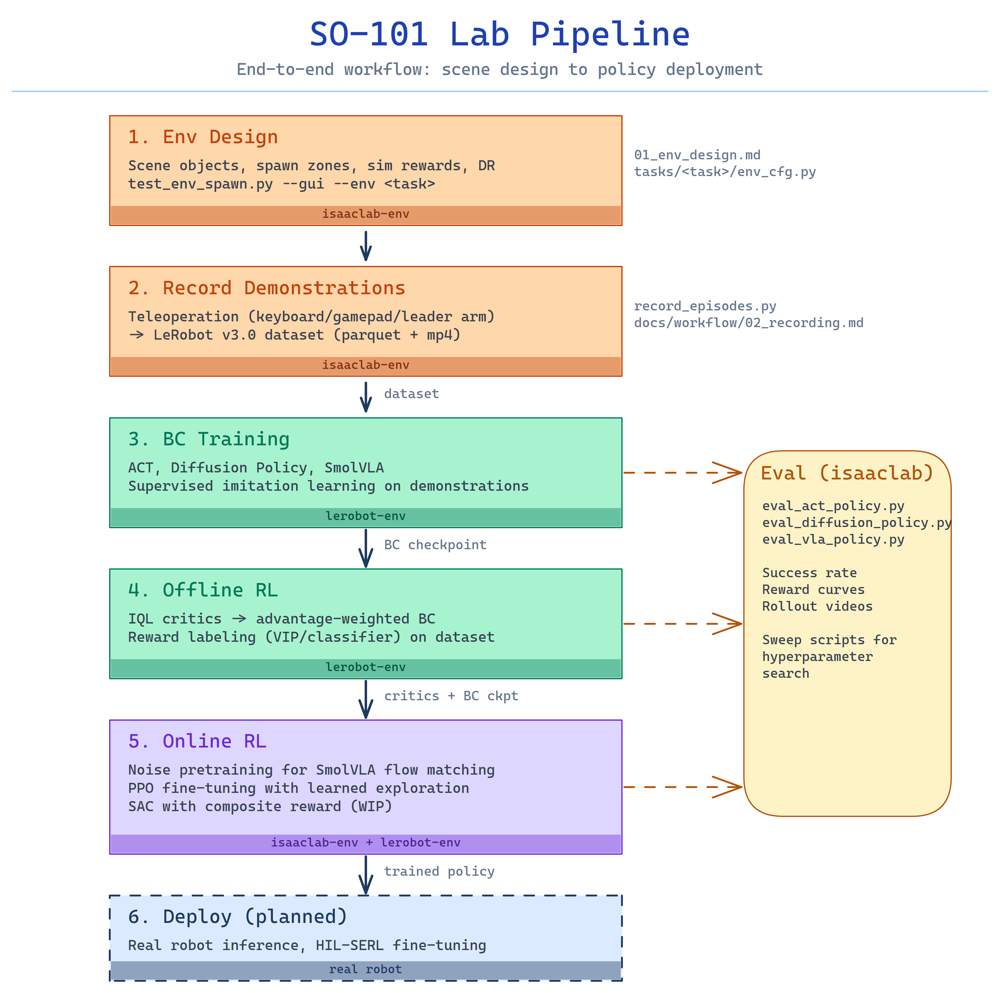

# SO-101 Lab

> Train manipulation policies for the SO-101 robot arm — from teleoperated demos in Isaac Sim to RL fine-tuning and real robot deployment (in development).

<p>
  
  
  
  
</p>

---

## Capabilities

- **LeRobot dataset from Isaac Sim** — record teleoperated demonstrations in simulation, save as LeRobot v3.0 format (parquet + H.264 video)
- **Isaac Lab environments** — task environments with spawn zones, domain randomization, and configurable sim rewards
- **SmolVLA fine-tuning research** — IQL advantage-weighted BC, Flow-Noise PPO for flow matching, learned initial noise sampler
- **Multiple RL approaches** — IQL (offline), Flow-Noise PPO (online, on-policy), SAC (online, off-policy, *in progress*)
- **VIP reward model** — dense reward labeling from ResNet50 Ego4D embeddings, no manual reward engineering
- **Sim-to-real pipeline** — calibrated cameras, domain randomization (light, physics, camera noise, distractors)
- **Ready-made scene assets** — children's shape sorting game (cube, star, hexagon, cylinder, etc.) as USD props for Isaac Sim pick-and-place tasks

**Want to record a task in Isaac Sim and train a policy?** Follow the [step-by-step workflow](docs/workflow/).

---

## Demo

Same scene, same seed — three methods compared side-by-side:


| SmolVLA BC | SmolVLA + Flow-Noise PPO | SmolVLA + IQL |
|:---:|:---:|:---:|
| fail | success | success |

<sub>Medium spawn zone, relaxed success thresholds (9 cm / 30°).</sub>

<details>
<summary>Teleoperation (leader arm → sim)</summary>


</details>

---

## Results

### Easy task

`figure_shape_placement_easy` — 200 teleoperated episodes, small spawn zone.

| Method | Success rate |
|--------|:-----------:|
| ACT | 56% |
| Diffusion Policy | 0% |
| SmolVLA BC | 70–76% |
| SmolVLA + IQL weighted BC | 86–88% |
| SmolVLA + Learned Sampler + PPO | **90%** |

### Medium task

`figure_shape_placement` — 300 episodes, 4× spawn area.

| Method | Success rate | vs BC |
|--------|:-----------:|:-----:|
| SmolVLA BC | 22% | — |
| SmolVLA + PPO | 24% | +2% |
| SmolVLA + IQL weighted BC | **32%** | **+10%** |

<sub>50 eval episodes (easy) / 100 episodes (medium), shared seed. Details: [easy task](docs/results/easy_task.md) · [medium task](docs/results/medium_task.md)</sub>

---

## Quick start

### 1. Setup

```bash
cp .env.example .env   # configure venv paths

# Isaac Lab env (sim, eval, RL training)
eval "$(./activate_isaaclab.sh)"
pip install -e .

# LeRobot env (BC/VLA training, IQL critics)
eval "$(./activate_lerobot.sh)"
pip install -e ".[hardware]"
```

<sub>Full setup: [docs/workflow/00_setup.md](docs/workflow/00_setup.md) · Why four venvs: [docs/architecture.md](docs/architecture.md#virtual-environments)</sub>

### 2. Record → Train → Evaluate

```bash
# Record episodes (isaaclab-env)
python scripts/teleop/record_episodes.py \
    --output data/recordings/my_task_v1 \
    --env figure_shape_placement_easy \
    --headless --teleop-device=so101leader \
    --calibration-file=leader_1.json --port=/dev/ttyACM0

# Train ACT (lerobot-env)
python scripts/train/train_act.py \
    --dataset data/recordings/my_task_v1 \
    --config configs/policy/act/baseline.yaml --name act_v1

# Evaluate (isaaclab-env)
python scripts/eval/eval_act_policy.py \
    --checkpoint outputs/act_v1 \
    --env figure_shape_placement_easy --episodes 50 --headless
```

<sub>Full workflow: [docs/workflow/](docs/workflow/) · End-to-end guide: [docs/guide.md](docs/guide.md)</sub>



---

## Project structure

```
so101_lab/                  # Library
  assets/                   #   Robot and scene configs (SO-101 URDF/USD, workbench)
  tasks/                    #   Isaac Lab environments (template, pick_cube, figure_shape_*)
  devices/                  #   Teleoperation devices (keyboard, gamepad, SO-101 leader arm)
  data/                     #   Dataset recording (LeRobot v3.0 format)
  policies/                 #   Inference wrappers: act/, diffusion/, rl/
  rewards/                  #   Reward models (VIP, classifier)
  rl/                       #   Isaac Lab RL components (gym wrapper, domain rand)
  transport/                #   gRPC for cross-venv communication (isaaclab ↔ lerobot)
  utils/                    #   Shared utilities

scripts/                    # Runnable scripts (teleop, eval, train, tools, test)
configs/                    # Policy training configs (YAML)
docs/                       # Documentation
```

<sub>Detailed layout: [docs/reference/structure.md](docs/reference/structure.md)</sub>

---

## Stack

| Component | Technology |
|-----------|-----------|
| Simulator | NVIDIA Isaac Sim 5.1 + Isaac Lab 2.3.0 |
| Robot | SO-101 (6-DOF, Feetech STS3215 servos) |
| Policies | ACT, Diffusion Policy, SmolVLA |
| RL | IQL, Flow-Noise PPO, SAC |
| Rewards | VIP (ResNet50, Ego4D), binary classifier, sim rewards |
| Dataset | LeRobot v3.0 (parquet + H.264 video) |
| Transport | gRPC (Python 3.11 ↔ 3.12 bridge) |

---

## Documentation

| | |
|---|---|
| **[Guide](docs/guide.md)** | End-to-end workflow by task |
| **[Workflow](docs/workflow/)** | Step-by-step: setup → record → train → eval → deploy |
| **[Architecture](docs/architecture.md)** | System design, venv split, data format |
| **[Reference](docs/reference/index.md)** | Every script and module |
| **[Troubleshooting](docs/troubleshooting.md)** | Common issues and fixes |
| **[Results](docs/results/)** | Experiment results and analysis |

---

## Attribution

Built on [LeRobot](https://github.com/huggingface/lerobot) and [leisaac](https://github.com/LightwheelAI/leisaac). Key methods and ideas:

- **IQL** — Kostrikov et al. 2022 ([arxiv 2110.06169](https://arxiv.org/abs/2110.06169)) — offline critic training
- **SAC** — Haarnoja et al. 2018 ([arxiv 1801.01290](https://arxiv.org/abs/1801.01290)) — online RL, RLPD pattern (Ball et al. 2023)
- **VIP** — Ma et al. 2023 ([github](https://github.com/facebookresearch/vip)) — dense reward labeling
- **GreenVLA** — [arxiv 2602.00919](https://arxiv.org/abs/2602.00919) — IQL advantage-weighted BC, learned noise sampler
- **ReinFlow** — Zhang et al. 2025 ([arxiv 2505.22094](https://arxiv.org/abs/2505.22094)) — flow-noise PPO for flow matching policies
- **DPPO** — Ren et al. 2024 ([arxiv 2409.00588](https://arxiv.org/abs/2409.00588), ICLR 2025) — PPO for denoising-based policies

<sub>Full details: [docs/attribution.md](docs/attribution.md)</sub>
