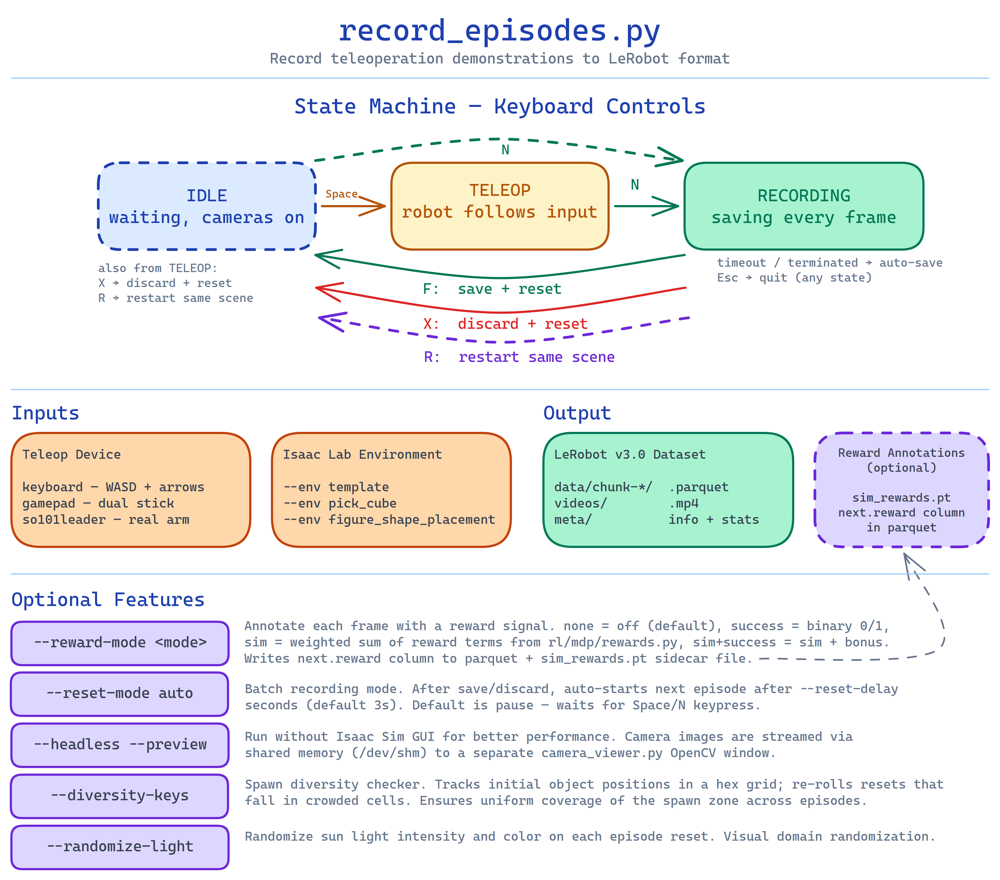
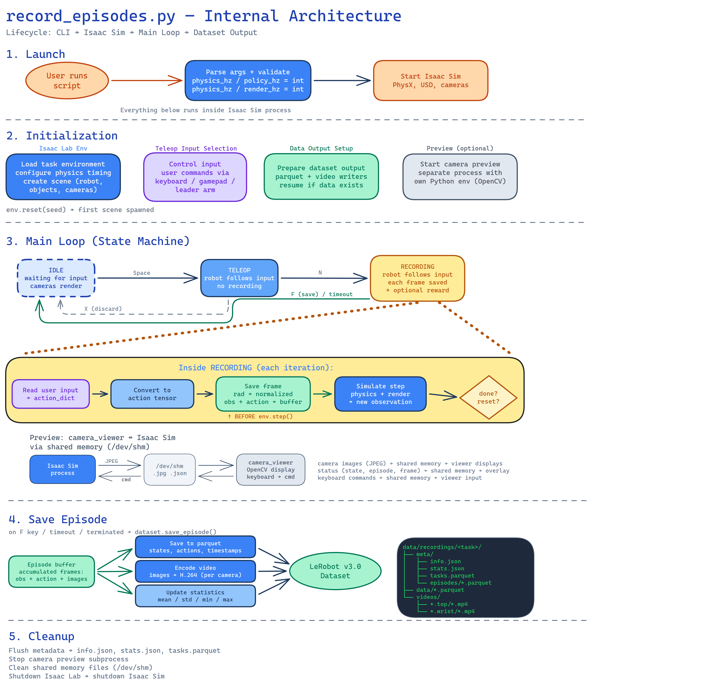

# record_episodes.py

Record teleoperated demonstrations to LeRobot v3.0 dataset. Isaac Lab venv.

---

Runs in **Isaac Lab env** (`act-isaac`). See [setup](../workflow/00_setup.md).

## Overview

Single script for teleoperation recording with optional reward annotations.

- Default (`--reward-mode none`): records state + action + video
- With rewards (`--reward-mode success|sim|sim+success`): also writes `next.reward` field to parquet
- `sim_rewards.pt` (per-frame shaped rewards) is saved whenever `rl/mdp/rewards.py` is available, regardless of `--reward-mode`

Recording semantics: `(observation_before, action)` pairs — observation is captured before applying the action.



---

## State Machine

```
IDLE ──Space──► TELEOP ──N──► RECORDING
  ▲                │               │
  │   X (discard)  │   F (save)    │
  └────────────────┴───────────────┘
```

- **Space** — start teleop (IDLE → TELEOP)
- **N** — start recording (IDLE/TELEOP → RECORDING)
- **F** — save episode + reset (RECORDING → IDLE)
- **X** — discard episode + reset (TELEOP/RECORDING → IDLE)
- **Escape** — quit (saves if recording)

Keys work in both the Isaac Sim window and the camera_viewer.py window.

After F/X: if `--reset-mode=auto`, recording starts automatically after `--reset-delay` seconds.

---

## Camera Preview (two-process design)

By default, `record_episodes.py` auto-launches `scripts/tools/camera_viewer.py` as a subprocess using `venvs/viewer` (OpenCV GUI venv). Images and commands are exchanged via `/dev/shm`:

| File | Writer | Content |
|------|--------|---------|
| `/dev/shm/so101_camera_top.jpg` | record_episodes | Top camera JPEG |
| `/dev/shm/so101_camera_wrist.jpg` | record_episodes | Wrist camera JPEG |
| `/dev/shm/so101_status.json` | record_episodes | State, episode, frame |
| `/dev/shm/so101_command.json` | camera_viewer | User commands |

Why two processes: Isaac Sim bundles a headless OpenCV (no `imshow`), so the viewer must run in a separate process with system OpenCV.

Setup (first time):
```bash
uv venv venvs/viewer
source venvs/viewer/bin/activate
uv pip install opencv-python numpy
```

If `venvs/viewer` is not found, script continues without preview.

---

## CLI

```bash
python scripts/teleop/record_episodes.py [FLAGS]
```

| Flag | Default | Description |
|------|---------|-------------|
| `--env` | `template` | Task: `template`, `pick_cube`, `figure_shape_placement`, ... |
| `--teleop-device` | `keyboard` | `keyboard`, `gamepad`, `so101leader` |
| `--output` | `data/recordings/dataset` | Output directory (prompts if not set) |
| `--task` | `"default task"` | Task description string stored in dataset |
| `--episode-length` | `120.0` | Max episode length in seconds |
| `--physics-hz` | `120` | PhysX simulation frequency |
| `--policy-hz` | `30` | Action update frequency |
| `--render-hz` | `30` | Camera render frequency |
| `--preview-hz` | `30` | OpenCV preview throttle (0 = no throttle) |
| `--reset-mode` | `pause` | `pause` or `auto` |
| `--reset-delay` | `3.0` | Seconds before auto-start (auto mode) |
| `--preview` / `--no-preview` | preview on | Enable/disable camera preview |
| `--headless` | off | Launch Isaac Sim without GUI (preview still works) |
| `--crf` | `23` | Video quality 0–51 (lower = better; 23 = visually near-lossless) |
| `--gop` | `auto` | GOP/keyframe interval (`2` = fast random access for training) |
| `--randomize-light` | off | Randomize sun light at each reset |
| `--diversity-keys` | `""` | Comma-separated `initial_state` keys for spawn diversity check |
| `--diversity-ratio` | `2.0` | Cell crowded if `count >= mean * ratio` |
| `--diversity-target` | `5.0` | Target points per hex cell (determines cell size) |
| `--port` | `/dev/ttyACM0` | Serial port for SO101Leader |
| `--calibration-file` | `so101_leader.json` | Calibration file name |
| `--recalibrate` | off | Force recalibration (must set unique `--calibration-file`) |
| `--sensitivity` | `1.0` | Control sensitivity (keyboard/gamepad) |
| `--reward-mode` | `none` | `none`, `success`, `sim`, or `sim+success` |
| `--success-bonus` | `10.0` | Bonus added at is_success() for `sim+success` mode |
| `--reward-weights` | `""` | Per-term weights: `"drop_penalty=-10,time_penalty=-0.05"` |

Reward modes control what goes into `next.reward` in parquet:
- `none` — no `next.reward` field (default)
- `success` — binary 0/1 based on `is_success()` (works with any env)
- `sim` — weighted sum of sim reward terms from `tasks/<env>/rl/mdp/rewards.py`
- `sim+success` — sim reward sum + `--success-bonus` on `is_success()`

Sim reward terms are auto-discovered; unspecified terms get weight 1.0.
`sim_rewards.pt` is always saved when `rl/mdp/rewards.py` is available — even with `--reward-mode success`.

---

## Frequency Architecture

Physics runs at max speed (no sleep). Preview is throttled independently.

```
physics-hz  ──decimation──►  policy-hz  (action step)
                               = recording-hz  (must be equal)
physics-hz  ──render_interval──►  render-hz  (camera capture)
preview-hz  (independent throttle on /dev/shm writes)
```

Validation at startup:
- `recording-hz` must equal `policy-hz`
- `policy-hz` must not exceed `physics-hz`
- Non-divisible combinations print a warning

Performance: headless ~5–6x realtime, GUI ~2–3x realtime.

---

## Output Format

```
data/recordings/<name>/
├── meta/
│   ├── info.json                     # fps, features, robot_type
│   ├── stats.json                    # state/action statistics
│   ├── tasks.parquet                 # task strings
│   ├── episode_metadata.json         # seed + initial_state per episode
│   └── episodes/chunk-000/file-000.parquet
├── data/chunk-000/file-000.parquet   # state, action, timestamp, task_index
└── videos/
    ├── observation.images.top/chunk-000/file-000.mp4
    └── observation.images.wrist/chunk-000/file-000.mp4
```

Frame schema:
```python
{
    "observation.state": np.ndarray,  # (6,) float32, normalized motors [-100, 100]
    "action": np.ndarray,             # (6,) float32, normalized motors [-100, 100]
    "observation.images.top": ...,    # (480, 640, 3) uint8
    "observation.images.wrist": ...,  # (480, 640, 3) uint8
    "timestamp": float,
    # only when --reward-mode is not "none":
    "next.reward": float,
}
```

`sim_rewards.pt` (when `rl/mdp/rewards.py` is available): dict of `{term_name: [float, ...]}` per episode, saved alongside the dataset.

---

## Usage Examples

All commands require Isaac Lab env. See [workflow/00_setup.md](../workflow/00_setup.md) for setup.

```bash
act-isaac  # activate Isaac Lab env

# Basic (keyboard, headless, preview window auto-launches)
python scripts/teleop/record_episodes.py \
    --headless \
    --env figure_shape_placement \
    --output data/recordings/figure_v1 \
    --task "place cube in slot"

# Leader arm, auto-restart batch recording
python scripts/teleop/record_episodes.py \
    --headless \
    --teleop-device=so101leader \
    --calibration-file=leader_1.json \
    --reset-mode=auto --reset-delay=3.0 \
    --output data/recordings/figure_v1

# With reward annotation (for offline RL)
python scripts/teleop/record_episodes.py \
    --headless \
    --env figure_shape_placement \
    --reward-mode success \
    --output data/recordings/figure_v1_rewards

# With spawn diversity (200+ episodes)
python scripts/teleop/record_episodes.py \
    --headless \
    --diversity-keys cube_x,cube_y \
    --output data/recordings/figure_v1

# GOp=2 for training-optimized video (fast random access)
python scripts/teleop/record_episodes.py \
    --headless --gop 2 \
    --output data/recordings/figure_v1
```

---

## Spawn Diversity

Module `so101_lab/utils/spawn_diversity.py` prevents clustering in spawn positions when recording 200+ episodes. Uses a hex-grid to track spatial distribution and re-rolls crowded cells (up to 5 attempts).

Activated by `--diversity-keys cube_x,cube_y` (keys from `episode_metadata.json`). Only active after 10+ episodes.

Check existing dataset:
```bash
python -c "
from so101_lab.utils.spawn_diversity import SpawnDiversityChecker
c = SpawnDiversityChecker('data/recordings/figure_v1', ['cube_x', 'cube_y'])
print(c.report())
"
```

---

## Video Encoding Notes

- Default: H.264, CRF=23 (~10% of raw size, good quality)
- `--gop 2`: keyframe every 2 frames — critical for training (policy loaders do random frame access; default GOP ~250 causes slow seeks)
- `--crf 18`: near-lossless, ~15-20% of raw
- LeRobot uses AV1 CRF=30 (~3%), but encoding is slower

---

## Dataset Visualization

```bash
source venvs/rerun/bin/activate
python scripts/visualize_lerobot_rerun.py data/recordings/figure_v1

# Specific episodes
python scripts/visualize_lerobot_rerun.py data/recordings/figure_v1 -e 0 2 5

# Lower RAM (smaller video batch)
python scripts/visualize_lerobot_rerun.py data/recordings/figure_v1 --batch-size 500
```

Setup (first time):
```bash
uv venv venvs/rerun
source venvs/rerun/bin/activate
uv pip install rerun-sdk pandas pyarrow opencv-python numpy
```

---

## Internal Architecture



---

## Notes / Gotchas

- `--recalibrate` requires a unique `--calibration-file` name (prevents overwriting existing calibration)
- `recording-hz` must equal `policy-hz` — there is no sub-sampling; every policy step is recorded
- `--gop auto` uses FFmpeg default (~250) — suitable for viewing but slow for training; use `--gop 2` for datasets you will train on
- Spawn diversity checker is only reliable with 100+ existing episodes (bounding box stabilizes with data)
- If `trim_after_success.py` will be used later, record with `--gop 2` for lossless keyframe cuts
