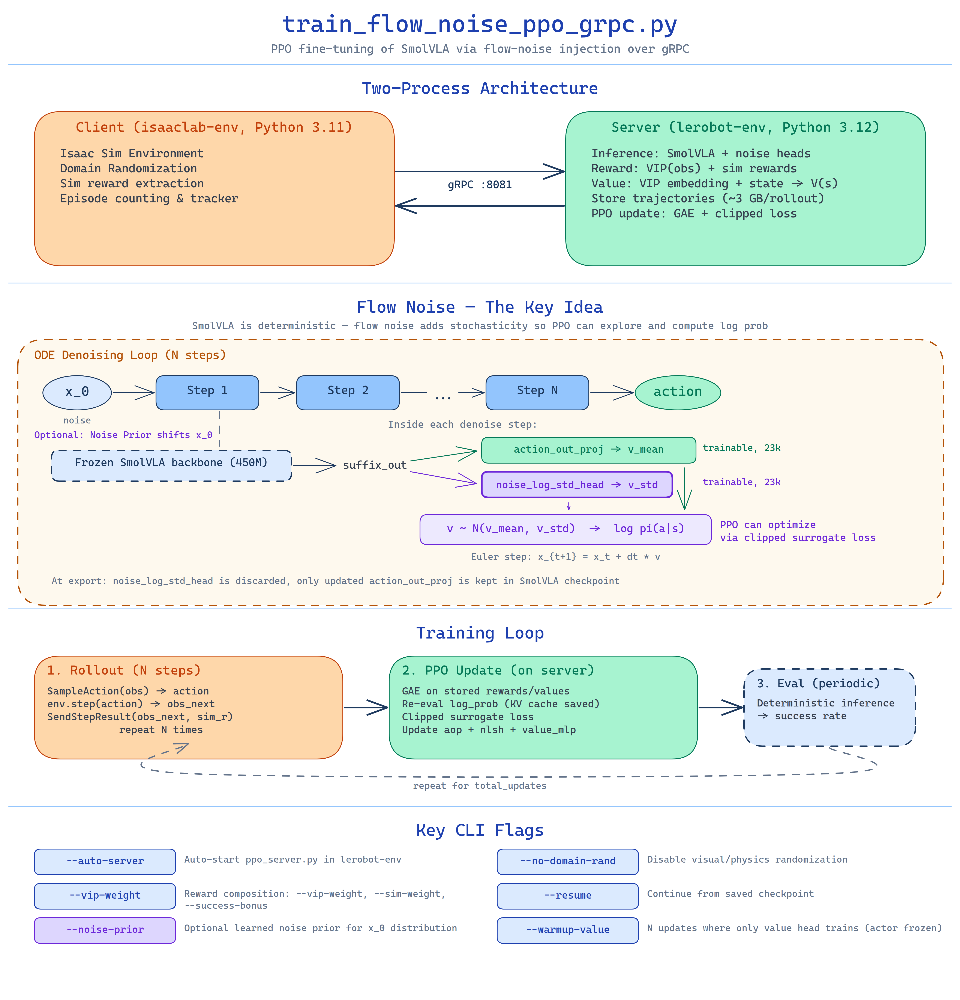

# Flow-Noise PPO via gRPC

PPO fine-tuning of SmolVLA via flow-noise injection. gRPC two-process version that splits the env (Python 3.11) from the model (Python 3.12) to work with lerobot 0.5.1.



## How flow noise works

SmolVLA uses flow matching: an ODE denoising loop that takes random noise x₀ and produces actions through N deterministic steps. First, the frozen backbone processes images + language + state into a KV cache (prefix, ~450M params, computed once per observation). Then each ODE step feeds the current x_t + timestep through the transformer using this cached prefix to get `suffix_out` — features conditioned on both the observation and the current ODE state. Finally, `action_out_proj(suffix_out)` predicts velocity v — the direction to step in action space. The problem: this is fully deterministic, so there's no log π(a|s) and PPO cannot work.

**Flow noise** adds a parallel trainable head `noise_log_std_head` that predicts v_std from the same suffix_out. Now each ODE step samples velocity from N(v_mean, v_std) instead of using v_mean directly. This gives:

1. **Stochastic policy** — PPO can explore
2. **Tractable log π(a|s)** — sum of Gaussian log_prob across ODE steps
3. **Efficient gradients** — only through action_out_proj (23k params) + noise_log_std_head (23k params); the 450M backbone stays frozen

### What trains

During PPO update, `actor_loss.backward()` updates both heads:

- **action_out_proj** learns better v_mean → better actions
- **noise_log_std_head** learns adaptive exploration — more noise where exploration helps, less where precision matters

A separate **value_mlp** (593k params, VIP embedding + joint state → scalar) estimates V(s) for GAE advantage computation.

### Noise prior vs flow noise

These are two independent mechanisms:

- **Noise prior** (`--noise-prior`) — changes the initial noise x₀ distribution (shifts the ODE starting point). Pre-trained offline, optional.
- **Flow noise** (noise_log_std_head) — adds stochasticity at each ODE step. Created at training time, required for PPO.

### After training

`export_smolvla_checkpoint()` saves a standard SmolVLA checkpoint with the updated action_out_proj weights. noise_log_std_head is discarded — inference is deterministic again, just with better action predictions. The exported checkpoint works with `eval_vla_policy.py` and all standard LeRobot tools.

## Why two processes

Isaac Sim requires Python 3.11 (native C++ extensions). LeRobot 0.5.1 uses PEP 695 syntax (Python 3.12). The original script ran both in one process via a `sys.path` hack that breaks with lerobot 0.5.1.

The key insight: PPO gradient flow does **not** require Isaac Sim. Rollout collection is pure inference (forward pass only). The PPO update (backward through SmolVLA) operates on stored trajectories — no env needed. So the env and model can live in separate processes.

## Architecture

```
isaaclab-env (Python 3.11)              lerobot-env (Python 3.12)
┌─────────────────────────┐             ┌──────────────────────────────┐
│  train_flow_noise_ppo_  │             │  ppo_server.py               │
│  grpc.py                │             │                              │
│                         │             │  FlowNoiseSmolVLA (450M)     │
│  Isaac Sim env          │◄── gRPC ──► │  VIPReward (ResNet50)        │
│  Domain randomization   │  localhost  │  Value head (593k params)    │
│  Reward details         │             │  Rollout buffer (~3 GB)      │
│  Tracker (tqdm/trackio) │             │  Adam optimizers             │
│                         │             │  PPO update (GAE + epochs)   │
└─────────────────────────┘             └──────────────────────────────┘
```

**Client** owns: env lifecycle, sim reward extraction, episode counting, logging/checkpointing triggers.

**Server** owns: all ML state — model weights, VIP backbone, trajectory cache, optimizers, reward computation, PPO update. Nothing ML-related crosses the wire.

## Data flow per step

```
Client                              Server
──────                              ──────
1. SampleAction(obs) ───────────►   cache_vip_embedding(obs)
                                    get_value(vip_emb, state)
                                    sample_actions_with_log_prob(obs)
                                    store: trajectory, vip_emb, state,
                                           log_prob, value
   ◄─── ActionResult(action,        return action, log_prob, value
         log_prob, value)

2. env.step(action) → obs_next
   get_reward_details() → sim_r

3. SendStepResult(obs_next, ────►   vip_reward.compute_reward(obs_next)
     sim_rewards, done)             combine: vip_w * vip_r + sim_w * sim_r
                                    store: reward, done
   ◄─── Empty

4. If done: ResetPolicy() ──────►   policy.policy.reset()
```

After N rollout steps:

```
5. RunPPOUpdate(bootstrap_obs, ──►  bootstrap last value
     config)                        GAE on stored rewards/values/dones
                                    PPO epochs: re-eval log_prob from
                                      stored trajectories (no prefix
                                      recompute — KV cache saved),
                                      value from cached VIP embeddings
                                    Clear rollout buffer
   ◄─── UpdateMetrics(losses,       return all metrics
         ratios, rewards...)
```

## What stays on the server (~3 GB/rollout)

Per rollout step, the server stores:
- **trajectory** (~8 MB): `x_t` and `v_sampled` tensors per ODE step + prefix KV cache (4 MB)
- **vip_emb** (8 KB): cached VIP embedding (2048 floats)
- **state** (24 bytes): joint positions (6 floats)
- **log_prob, value**: scalars

For 256 rollout steps: ~2-4 GB total. This data is needed for PPO re-evaluation (computing new log_prob under updated policy parameters) and is consumed/cleared after each PPO update.

## What crosses the wire

Per step: ~1.8 MB (SampleAction: 2 images + state) + ~1 MB (SendStepResult: 1 image + state + reward floats + done) ≈ 2.8 MB. Over localhost at ~150ms/step: ~19 MB/s. Negligible.

## Files

| File | Process | Description |
|------|---------|-------------|
| `scripts/train/train_flow_noise_ppo_grpc.py` | Client (il) | Env loop + gRPC calls + tracker |
| `scripts/train/ppo_server.py` | Server (lr) | Model + VIP + rollout buffer + PPO update |
| `so101_lab/transport/ppo.proto` | Both | Protobuf service definition (9 RPCs) |
| `so101_lab/transport/ppo_client.py` | Client (il) | `PPOTrainingClient` class |
| `so101_lab/transport/utils.py` | Both | Chunking, serialization (standalone, no lerobot imports) |
| `so101_lab/transport/ppo_pb2.py` | Both | Generated protobuf stubs |
| `so101_lab/transport/ppo_pb2_grpc.py` | Both | Generated gRPC stubs |

## gRPC service (9 RPCs)

| RPC | Direction | Purpose |
|-----|-----------|---------|
| `Ready` | C→S | Connection handshake |
| `Init` | C→S (stream) | Send config, server loads model + VIP + optimizers |
| `SampleAction` | C→S (stream) | obs → action + log_prob + value |
| `SendStepResult` | C→S (stream) | obs_next + sim rewards + done → server computes VIP reward |
| `RunPPOUpdate` | C→S (stream) | bootstrap obs + config → PPO update → metrics |
| `SetMode` | C→S | Switch train/eval (noise bounds) |
| `SampleActionDeterministic` | C→S (stream) | Deterministic inference for eval |
| `ResetPolicy` | C→S | Reset SmolVLA KV cache + action chunking |
| `SaveCheckpoint` | C→S (stream) | Save weights + SmolVLA export |

All large payloads use streaming `DataChunk` messages (2 MB chunks, pickle serialization).

## Recompiling proto stubs

If you modify `ppo.proto`, regenerate stubs from the repo root:

```bash
python -m grpc_tools.protoc \
    -I . --python_out=. --grpc_python_out=. \
    so101_lab/transport/ppo.proto
```

Requires `grpcio-tools` (`uv pip install grpcio-tools`).

## Differences from single-process version

| Aspect | `train_flow_noise_ppo.py` | `train_flow_noise_ppo_grpc.py` |
|--------|--------------------------|-------------------------------|
| Python | 3.11 only (sys.path hack) | 3.11 client + 3.12 server |
| lerobot 0.5.1 | Broken (SyntaxError) | Works |
| Model location | Same process | Server process |
| VIP reward | Same process | Server process (on obs_next) |
| Trajectory data | Same memory | Server memory (~3 GB, never transferred) |
| Overhead | None | ~2.8 MB/step over localhost (~19 MB/s) |
| `--auto-server` | N/A | Starts ppo_server.py automatically |
